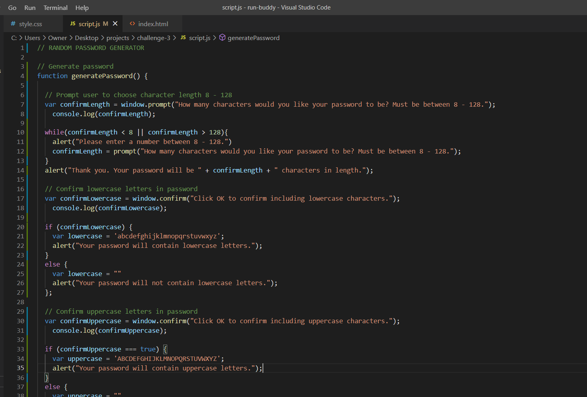

# Welcome to my Random Password Generator for Challenge 3!

### NOTE: This random password generator is not finished yet, so check back soon!

 ### The following JavaScript was written for this challenge. All code is working and displaying in console log up until lines 74 & 75.

 ## JS Code 1 of 3 - all code working well and displaying in console log.
 

 ## JS Code 2 of 3 
 

 ## JS Code 3 of 3 - this will where lines 74 and 75 return an error.
 

## Console Log Error 

## I will get the solution to my problem before class on Tuesday and submit the assignment ASAP!

### Click here to view my random password generator: https://jamwil1226.github.io/random-password-generator/

### All feedback is welcome!

### I look forward to hearing from you!

### _Jamie Williams_ 

